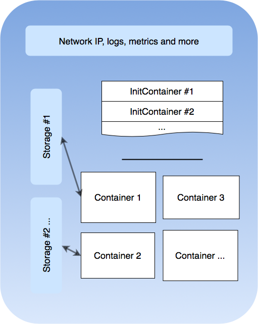
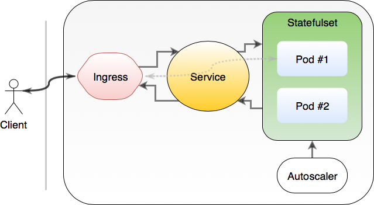
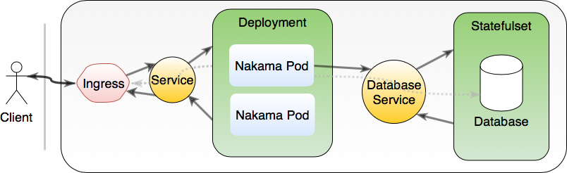
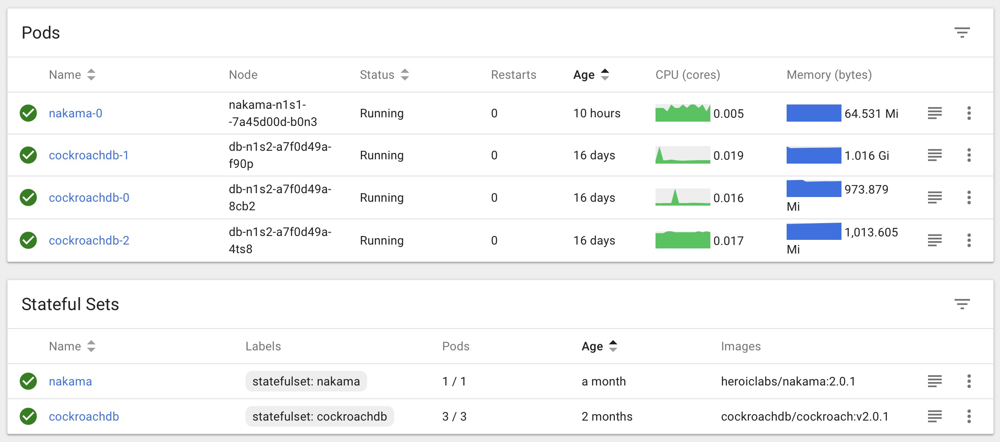
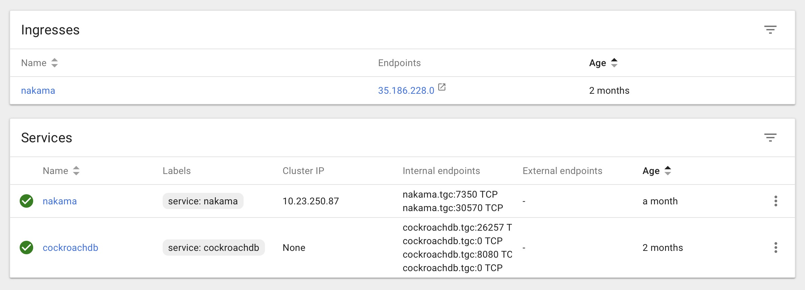

# <br/>
# Running game servers<br/>on Kubernetes
## Mo Firouz

---


^ Background is working in high-frequency trading system, and big data analytics.
Core infrastructure with focus on
streaming technologies
and highly scalable distributed systems.

# About me
- My name is Mo(hammad) Firouz!
- Originally Iranian - can speak Farsi with a funny accent.
- Software architect
<br/>
- Co-founder of Heroic Labs

---


# Heroic Labs

^ Just released v2
Written in Go, single binary
Platform agnostic, deploy-anywhere
Unity, JS, Coco2dx, Unreal, Android, iOS, Corono, Defold
Presence system, Virtual wallet, Leaderboard, Data storage, Tournaments
RESTful and WebSocket / rUDP


- Nakama, a realtime and social server for games.
- Completely open-source (and free!):
[https://github.com/heroiclabs/nakama](https://github.com/heroiclabs/nakama)
<br />
- Realtime, server-authoritative multiplayer
- Flexible matchmaking system
- Extendable using Lua scripting
- Friends, Clans, Chat + more

---


# Things to discuss

1. Intro to Kubernetes
2. System overview
3. Two examples of game servers
    - Nakama server
    - Unity Headless servers

---


# Intro to Kubernetes

^ Show of hands how many people heard-of/have used Kubernetes before?

^Originally designed by Google and now maintained by the Cloud Native Computing Foundation

^Different ways: Yaml, API, Kubectl
Restart failed processes
Standarize cloud provider access
Azure, AWS, GCP, Vsphere, Openstack
Imperative and Declarative management

> _System for automating deployment, scaling, and management of **containerized** applications_

- Hardware provisioning - replaces Puppet, Chef and Ansible.
- Supervisor-like responsibilities - healthcheck and uptime
- Log aggregation + metrics + scheduled jobs + (much) more

---


# Intro to Kubernetes

^ daemon worker pick up logs from stdout
Preferably use standard logging format
Add resource request/limit to allow autoscaling
Handle graceful restart/time

Some rules to follow:

1. Log to stdout and stderr
2. Return non-zero for abnormal exits
3. Add healthcheck endpoint - ideally to `/`
4. Add readiness endpoint - ideally to same as healthcheck
5. Use cmd args and env variables, not config files

---


# Intro to Kubernetes

^ Many other components:
Namespaces (multiple teams)
Cron/Jobs
DaemonSet
NetworkPolicy
Storage / PersistentVolumeClaim
PodDisruptionBudget
ServiceAccount / Roles

Kubernetes components

1. Pod
2. Controllers
3. Service + Ingress
4. Nodes
5. Autoscaling

---


# Pod

^ Recommend one application per pod
Smallest kubernetes component
Supposed to be created/destroyed anytime

^ Like a Russian doll:
Multiple containers in a pod
Multiple pods on a single node

^ Sidecar containers:
Access same network, interact between containers



- Wrap one or more containers
- Pods are ephemeral
  - can be dynamically created / deleted
- Unique network cluster-IP (but not permanent)
- Storage resource(s)

---


^ Example application here, Nakama.

^^ Labels are KV "selectors".

^ Mounting empty directory
Isolated folder on the host machine

^ Expose port 7350

# Pod

```yml
apiVersion: v1
kind: Pod
metadata:
  labels:
    app: nakama
spec:
  volumes:
  - name: nakama-volume
    emptyDir:
containers:
  - name: nakama
    image: heroiclabs/nakama
    command: "/bin/sh exec nakama"
    ports:
    - containerPort: 7350
      name: api
    volumeMounts:
    - mountPath: /nakama-data
      name: nakama-volume
```

---


^ Ways to access pods:
Services
Ingress
HostNetwork
HostPort

# Service

- A way to access pods
- Services have DNS names
  - `controller.namespace.service.cluster.local`
  - `controller.namespace`
- Expose applications internally and externally

---


# Service

- ClusterIP: cluster-internal IP
- NodePort: Expose port (mapping) on the physical node
- LoadBalancer: Cloud provider’s load balancer
- ExternalName: CNAME without any proxying

---


^ Default mode is ClusterIP
If a clusterIP is set to "none" -> "headless service"
clusterIP: none -> No load balancing
Good if service-discovery is built-into application

^ With selector, DNS endpoints are setup
Otherwise cluster-internal CNAME and A-record are configured

# Service

```yml
apiVersion: v1
kind: Service
metadata:
  name: nakamaservice
  labels:
    service: nakama
spec:
  selector:
    app: nakama
  type: NodePort
  ports:
  - port: 80
    targetPort: 7350
    name: api
```

---


# Ingress

- Very similar to LoadBalancer service
- Only allowing HTTP(S) traffic into the cluster
- SSL Termination
- Usually configures Cloud Provider traffic

---


^ A Secret is an object that contains a small amount of sensitive data.

^ To use a secret, a pod needs to reference the secret.
Or as a file in a volume mounted.

# Ingress

```yml
apiVersion: extensions/v1beta1
kind: Ingress
metadata:
  name: nakamaingress
  labels:
    ingress: nakama
  annotations:
    kubernetes.io/ingress.allow-http: "false"
spec:
  tls:
    - secretName: ingress-cert-secret
  backend:
    serviceName: nakama
    servicePort: 80
```

---
[.autoscale: true]


^ ReplicaSet -> ReplicationController -> Deployment

^ StatefulSet
DaemonSet
Job

# Controllers

^ Pod lifecycle (5):
Pending, Running, Succeeded (finished), Failed, Unknown

^ Pod status (5):
PodScheduled, Initialized, ContainersReady, Ready, Unschedulable

- Replicating homogeneous set of pods
- Ensures healthy pods are running
- Deployment:
  + Manage infrastructure state from current to desired
  + Rolling update
  + Scale up/down pod replicas
  + History and rollback

---


^ Way to manage databases, or queues

# Controller

- StatefulSet:
  + Very similar to Deployment
  + Sticky pod IDs - sequential gurantueed ordering
  + Disk and Network resources will stay the same across roll outs
<br />
- DaemonSets, (Cron)Jobs, and more...

---


^ if app is similar to RabbitMQ ram-backed queue, then use Parallel

# Controller

```yml
apiVersion: apps/v1beta2
kind: StatefulSet
metadata:
  name: nakamastatefulset
spec:
  serviceName: "nakamaservice" # This must exist before Statefulset is created
  revisionHistoryLimit: 1
  replicas: 2
  podManagementPolicy: OrderedReady # or Parallel
  updateStrategy:
    type: RollingUpdate
  selector:
    matchLabels:
      app: nakama # this must matches below
  template:
    metadata:
      labels:
        app: nakama
    # ...rest of pod template...
```

---
[.autoscale: true]


# Nodes

^ Ways to isolate pods from nodes:
- Setup separate pools
- taint / toleration

- Assign special pods to special nodes

```yml
nodeSelector:
  disktype: ssd
```

- Use `affinity` and `anti-affinity` to indicate soft/hard requirement for node attractiveness
- Use `taint` and `tolerations` to repel pods from nodes
- Use both to schedule pods only on nodes with special hardware
- Ensure to use resource `requests` and `limits` for pods to limit noisey neighbour problems.

---


^ This is soft / not required
node with greatest sum of weights is selected

# Nodes

```yml
affinity:
  podAntiAffinity:
    preferredDuringSchedulingIgnoredDuringExecution:
    - weight: 100
      podAffinityTerm:
        topologyKey: kubernetes.io/hostname
        labelSelector:
          matchExpressions:
          - key: app
            operator: In
            values:
            - nakama
```

---


^ Make sure that you've setup resource requests/limits
And setup node taints or selectors to avoid co-location

# Autoscaling

```yml
apiVersion: autoscaling/v2beta1
kind: HorizontalPodAutoscaler
metadata:
  name: nakamascaler
  labels:
    autoscaler: nakama
spec:
  scaleTargetRef:
    apiVersion: apps/v1
    kind: StatefulSet
    name: nakamastatefulset
  minReplicas: 1
  maxReplicas: 10
  metrics:
  - type: Resource
    resource:
      targetAverageUtilization: 50
      name: cpu
```

---


^^ Ingress sends request directly to pod
Gets pod IP from service
Autoscaler updates service automatically

# System overview



---
[.autoscale: true]


^ Nakama depends on a database to store info

# Nakama game server

- Realtime multiplayer
- Server-authoritative multiplayer
- Matchmaking
- Custom code runtime
<br />
- Presence system
- Friends, Groups/clans
- Realtime chat, notifications
- User accounts, authentication

---


# Nakama game server



---


^ Nakama NodePort

# Nakama game server



---


# Nakama game server



---


# Unity headless server

```sh
/Applications/Unity/Unity.app/Contents/MacOS/Unity -quit -batchmode -nographics \
  -logFile .unity-build.log \
  -projectPath $(pwd)/unity-fastpacedmultiplayer \
  -executeMethod BuildTools.QuickBuildLinux
```

```csharp
public static void QuickBuildLinux()
{
    BuildPlayerOptions opts = new BuildPlayerOptions
    {
        options = BuildOptions.Development & BuildOptions.EnableHeadlessMode,
        locationPathName = "/Users/mo/Desktop/server",
        target = BuildTarget.StandaloneLinux64
    };

    BuildPipeline.BuildPlayer(opts);
}
```

---


# Unity headless server

```yml, [.highlight: 6, 8, 15, 17]
metadata:
  generateName: "unity-"
  labels:
    app: unity-server
spec:
  hostNetwork: true
  containers:
    - image: mofirouz/unity-fastpacedmultiplayer:0.0.1
      name: unity-server
      imagePullPolicy: Always
      command:
      - "/bin/sh"
      - "-ecx"
      - >
        exec ./server -logFile /dev/stdout
      ports:
        - containerPort: 7777
          name: server-api
```

---


^ Demo?
Minikube
Weavescope

# <br />

Feel free to send questions;

> email: [mo@heroiclabs.com](mailto:mo@heroiclabs.com)
<br />
> twitter: [@mofirouz](https://twitter.com/mofirouz)
<br />
> skype: mo.firouz

Talk available on GitHub:
[https://github.com/mofirouz/gameservers-kubernetes](https://github.com/mofirouz/gameservers-kubernetes)


